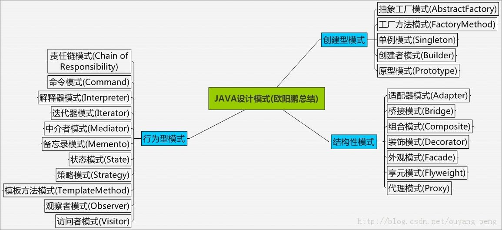

# 设计模式代码案例

# 介绍
设计模式（Design pattern） 是解决软件开发某些特定问题而提出的一些解决方案也可以理解成解决问题的一些思路。通过设计模式可以帮助我们增强代码的可重用性、可扩充性、 可维护性、灵活性好。我们使用设计模式最终的目的是实现代码的高内聚和低耦合。

设计模式是程序员在设计应用程序或系统时可以用来解决常见问题的最佳形式化实践。设计模式可以通过提供经过测试的，经过验证的开发范例来加快开发过程。重用设计模式有助于防止引起重大问题的细微问题，并且还可以为熟悉模式的程序员和架构师们提高代码可读性。

# 入门
这个项目主要展示的Java的设计模式，可供学习用。源代码示例得到了很好的注释。 对于设计模式相关详细的解释，我们放在了
<a href="https://blog.csdn.net/qq_41860497/category_11551015.html">设计模式博客介绍</a>
中。

# 项目目录 

对所有的设计模式进行了一个归类处理：

虽然说，`23`种设计模式，按照功能其实主要也就是三类。

## 1. 创建型模式

用于描述“怎样创建对象”，它的主要特点是“将对象的创建与使用分离”。`GoF（四人组）`书中提供了

|                                                              |                                                              |
| :----------------------------------------------------------: | :----------------------------------------------------------: |
| [单例模式: 某个类智能有一个实例，提供一个全局的访问点](https://blog.csdn.net/qq_41860497/article/details/125019384?spm=1001.2014.3001.5502) | [原型模式：通过复制现有的实例来创建新的实例](https://blog.csdn.net/qq_41860497/article/details/125026683) |
| [工厂方法模式：一个工厂类根据传入的参量决定创建出哪一种产品类的实例](https://blog.csdn.net/qq_41860497/article/details/125022748) | [抽象工厂模式：创建相关或依赖对象的家族，而无需明确指定具体类](https://blog.csdn.net/qq_41860497/article/details/125022748) |
| [建造者模式：封装一个复杂对象的创建过程，并可以按步骤构造](https://blog.csdn.net/qq_41860497/article/details/125028313) |                                                              |

等 5 种创建型模式。

## 2. 结构型模式

用于描述如何将类或对象按某种布局组成更大的结构，GoF（四人组）书中提供了

|                                                              |                                                              |
| :----------------------------------------------------------: | :----------------------------------------------------------: |
| [代理模式：为其它对象提供一个代理以便控制这个对象的访问](https://blog.csdn.net/qq_41860497/article/details/125043811) | [适配器模式：将一个类的方法接口转换成客户希望的另一个接口](https://blog.csdn.net/qq_41860497/article/details/125047920) |
| [桥接模式：将抽象部分和它的实现部分分离，使它们都可以独立的变](https://blog.csdn.net/qq_41860497/article/details/130653763) | [装饰模式：动态的给对象添加新的功能](https://blog.csdn.net/qq_41860497/article/details/130762041) |
|                           外观模式                           |                           享元模式                           |
|                           组合模式                           |                                                              |

等 7 种结构型模式

## 3. 行为型模式

用于描述类或对象之间怎样相互协作共同完成单个对象无法单独完成的任务，以及怎样分配职责。GoF（四人组）书中提供了

|          |        |
| :------: | :----: |
| 模板方法 |  策略  |
|   命令   | 职责链 |
|   状态   | 观察者 |
|  中介者  | 迭代器 |
|  访问者  | 备忘录 |
|  解释器  |        |

等 11 种行为型模式。

